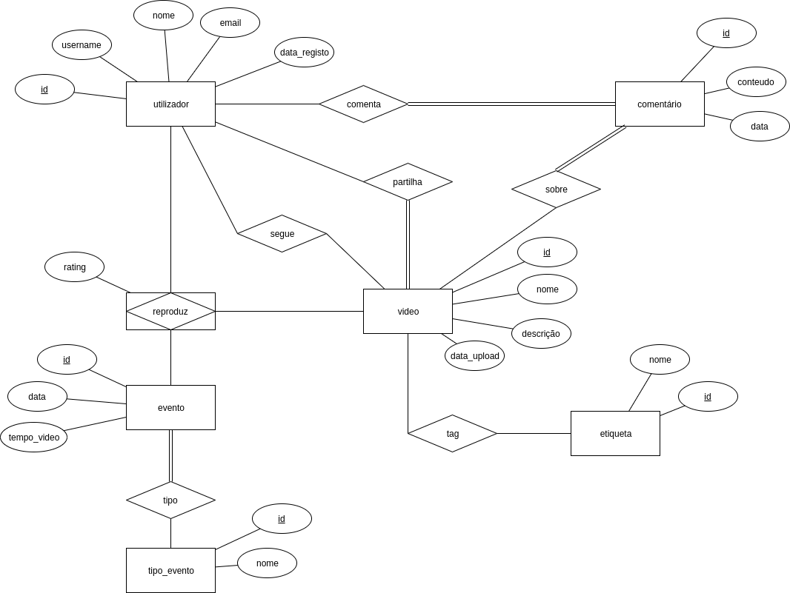

# Tabelas:
 - restaurant -> tabela com todos os restaurantes
    - Colunas:
        - id -> PK; int
        - addr -> fk para address
        - grade -> list<int>
        - localidade -> fk para localidade
        - gastronomia -> fk para gastronomia
        - nome -> text
- address -> tabela com os endereços dos restaurantes
    - Colunas:
        - building -> PK; int 
        - latitude -> float
        - longitude -> float 
        - road -> text
        - zipcode -> int
- grade -> tabela com as grades de cada restaurante
    - Colunas:
        - rest_id -> PK; FK; int
        - date -> date
        - grade -> char(1)
        - score -> int
- localidade -> tabela com as várias localidades dos restaurantes
    - Colunas:
        - id -> PK; int; autogerado
        - nome -> text; unique
- gastronomia -> tabela com as várias gastronomias que os restaurantes podem possuir
    - Colunas:
        - id -> PK; int; autogerado
        - nome -> text; unique

# Esquema da base de dados

